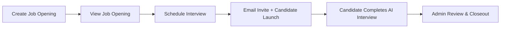

# TalentTalks Automation Test Plan

_Revision: 04-Dec-2025 • Target Env: https://talenttalks.vlinkinfo.com • Owner: QA Automation Guild_

## 1. Technology To Be Used
- **UI automation:** Behave + Selenium for recruiter console; Playwright for AI-interview candidate bot with webcam/mic emulation.
- **API/helpers:** Pytest suites covering config loader, email client, and REST probes for interview/job status.
- **Configuration:** `.env` driven secrets (`TALENTTALKS_BASE_URL`, recruiter creds, `GMAIL_KEY`) loaded through the shared config utility.
- **Data:** YAML/JSON fixtures plus timestamped builders for unique job titles, candidates, and slots.
- **CI/CD:** GitHub Actions matrix split into smoke (headless) and nightly (full device) runs with artifact retention (logs, screenshots, console, email payloads).

## 2. Reporting Approach
- Allure aggregates Behave + Pytest results with screenshots, DOM dumps, API payloads, and invite emails attached per step.
- `environment.properties` captures browser/env/build metadata for long-term trendability.
- Flaky tracking via rerun tags plus weekly charts (execution time, invite latency, AI duration, failure density).
- Jira linkage achieved by embedding ticket keys inside scenario tags for automatic cross-reference.

## 3. Flow To Be Tested
- **Create Job Opening:** Authenticated recruiter completes name/description/duration/toggles/tech stack; expect toast + `ACTIVE` grid row.
- **View Job Opening:** Filter/search table; confirm counts, status badge, and row actions (Schedule/Edit/Clone/Delete) enabled.
- **Schedule Interview:** Select template, input candidate data + timezone, toggle evaluations, upload resume/avatar; expect `Invite Sent` interview ID.
- **Candidate Joins From Email:** Mail client polls inbox, extracts CTA link, launches candidate browser, passes ID verification/system checks.
- **Candidate Completes AI Interview:** Playwright bot answers resume/static/coding prompts; verify AI score + recordings produced.
- **Admin Post-Interview Review:** Recruiter reviews interview row, checks status transitions, adds notes, downloads resume/report/recordings, optionally deletes/archives.

## 4. Entry and Exit Criteria
- **Job Opening Creation:** Entry = recruiter authenticated + unique title; Exit = template shows `ACTIVE`, allocation = 100%, toast logged.
- **Job Opening Verification:** Entry = template ID known; Exit = listing shows accurate counts/status with working row actions.
- **Interview Scheduling:** Entry = template ID + candidate data + files/timezone ready; Exit = interview row `Invite Sent`, email dispatched.
- **Candidate Interview:** Entry = valid invite link + candidate browser ready; Exit = status `Completed`, score + recordings available.
- **Admin Review:** Entry = completed interview ID; Exit = notes stored, downloads validated, optional delete/archive done.

## 5. Scope
**In Scope**
- Recruiter console journeys: login, dashboard, job creation/listing, interview scheduling, interview list management, notes, downloads, delete/archive.
- Candidate AI interview launched via invite email (identity verification, system checks, static + coding prompts, submission).
- Email delivery verification through the in-project mail client ensuring invite integrity.
- Evidence capture (screenshots, logs, HAR, email payloads) stored with Allure artifacts.

**Out of Scope**
- Backend/DB reconciliation beyond UI/API-exposed data.
- Load/performance testing beyond ~10 parallel candidate sessions.
- Accessibility/localization audits handled by separate workstreams.
